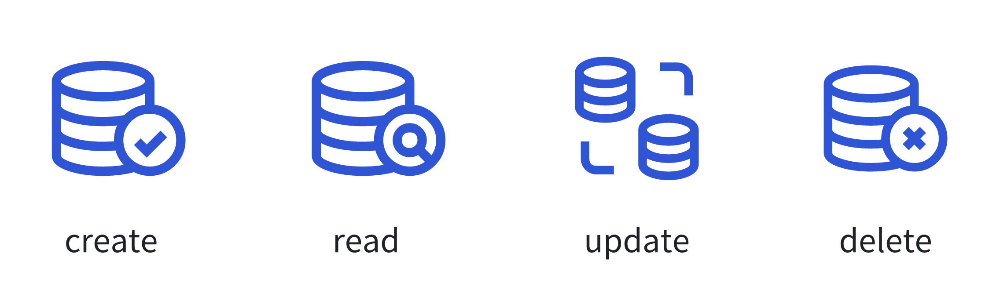
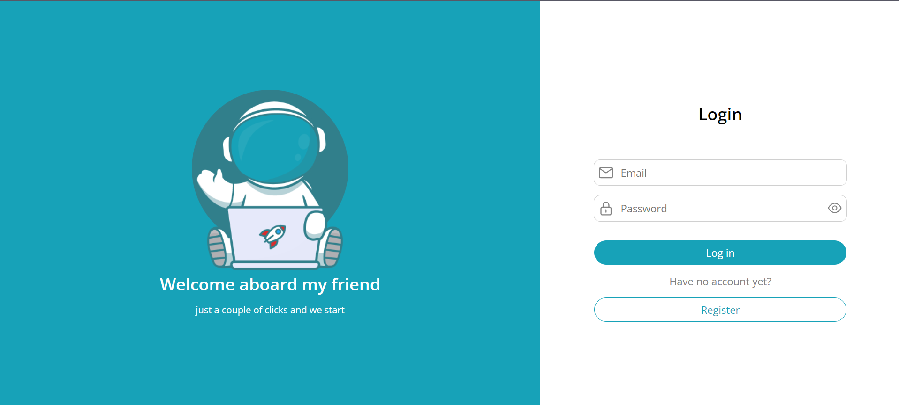
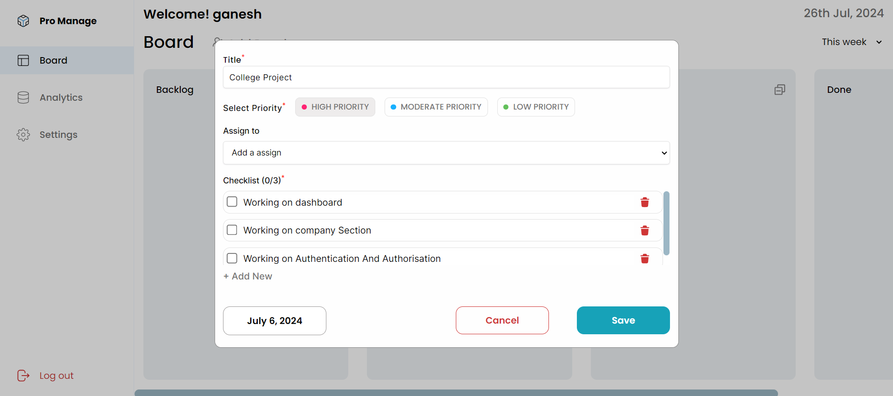
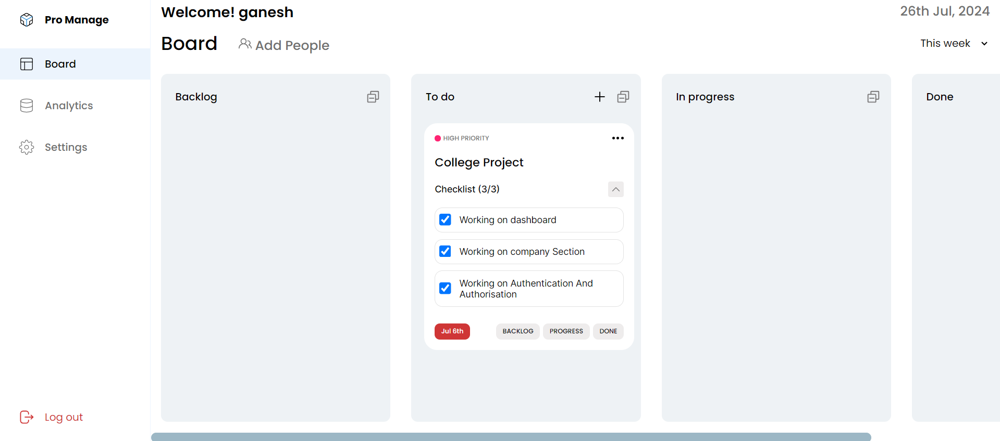
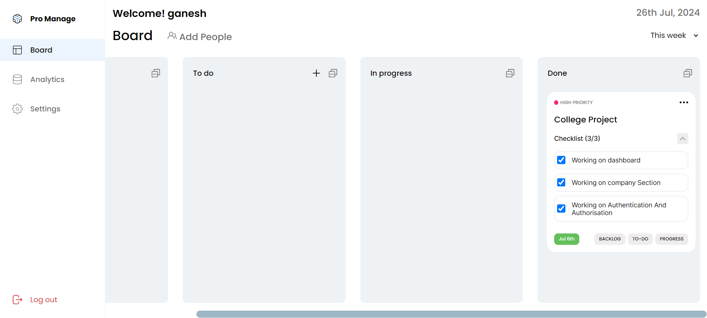
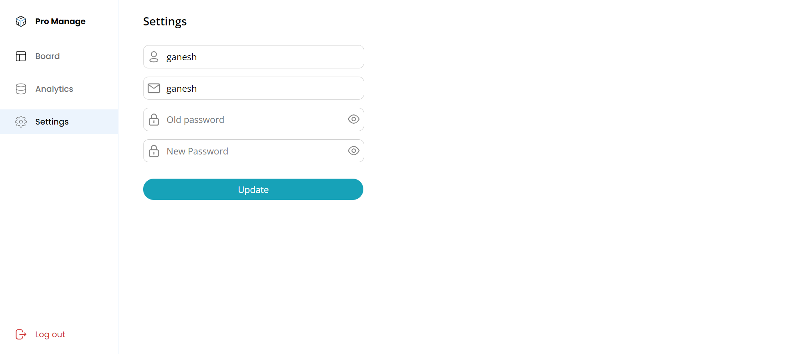
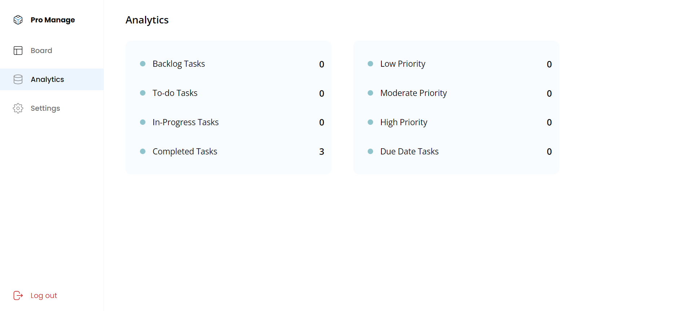

# ✅ TODO CRUD Application

This project is a **CRUD** (Create, Read, Update, Delete) application for managing ToDo items. It is built using the **MERN** stack, consisting of **MongoDB**, **Express.js**, **React.js**, and **Node.js**.

## ✨ Features

- 📝 **Create ToDo**: Add new ToDo items with details.
- 👁️ **Read ToDo**: View the list of all ToDo items.
- ✏️ **Update ToDo**: Edit details of existing ToDo items.
- ❌ **Delete ToDo**: Remove ToDo items from the list.
- 📱 **Responsive Design**: Optimized for both desktop and mobile views.

## 🛠️ Tech Stack

- **Frontend**: React.js, CSS, Tailwind CSS
- **Backend**: Node.js, Express.js
- **Database**: MongoDB

## ⚙️ Getting Started

### 📋 Prerequisites

Ensure you have the following installed on your local development environment:

- **Node.js** (v14 or later)
- **npm** (v6 or later)
- **MongoDB** (local or cloud-based)

### 📥 Installation

1. **Clone the repository**:

    ```bash
    git clone https://github.com/Ganesh-Gosavi/AssestmentTodoCrudOpn.git
    ```

2. **Navigate to the project directory**:

    ```bash
    cd assessment-todo-crud
    ```

3. **Install the dependencies** for both the client and server:

    - For the **client**:

        ```bash
        cd Frontend
        npm install
        ```

    - For the **server**:

        ```bash
        cd Backend
        npm install
        ```

## 🔧 Configuration

1. Create a `.env` file in the `server` directory and add the following environment variables:

    ```bash
    PORT=5000
    MONGO_URI=your_mongodb_connection_string
    ```

## 🚀 Running the Application

1. **Start the backend server**:

    ```bash
    cd Backend
    npm start
    ```

2. **Start the frontend development server**:

    ```bash
    cd Frontend
    npm start
    ```

3. Open your browser and navigate to `http://localhost:3000` to view the application.

## 📸 Screenshots















## 📝 License

This project is licensed under the MIT License. See the [LICENSE](LICENSE) file for details.
